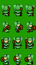
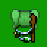
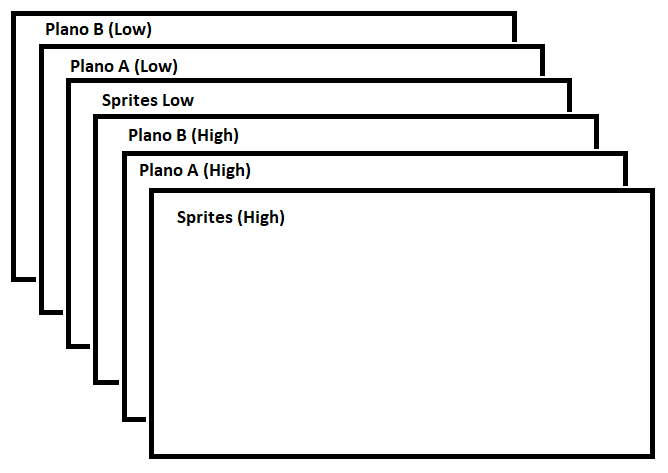

# Sprites

Un Sprite, es un mapa de bits que va a ser representado en una pantalla de ordenador con un hardware especifico sin necesidad de calculos adicionales de CPU. Normalmente se asocia un sprite a un objeto a representar en un videojuego; como puede ser el jugador o cualquier enemigo.

Normalmente un sprite se compone de una serie de imagenes que representan distintos frames a representar en la pantalla; cada frame se representará en un orden especifico para así formar una animación.


Como se ve en la anterior imagen, este sprites se compone de una serie de imagenes que cada linea corresponde a una animación; esto es importante cuando lleguemos a la parte de generar animaciones. 

Sin embargo, antes de continuar tenemos que tener en cuenta como funcionan los sprites dentro de la MegaDrive.

* Los sprites tienen su propio plano.
* La posicion de pantalla de los Sprites van en Píxeles y no en Tiles.
* Podemos tener un total de 80 sprites por pantalla.
* Solo se pueden tener 20 sprites por linea horizontal.
* La manera de cargar un sprite es igual que los Planos (en pixels).
* Un sprites siempre debe ser divisible por 8 ya que de otra forma no se podría cargar.
* El tamaño máximo de un sprites que SGDK permite manejar es de 16x16 tiles (128x128 píxeles).

## Añadir Sprites en SGDK

Como hemos comentado, para cargar los sprites se hacen de igual forma que para los planos; sin embargo, tenemos que tener en cuenta una serie de cambios. Como por ejemplo como se añade el fichero de recuros (.res).

Como con los planos, se debe crear un fichero para añadir los recursos; por lo que se añadira un fichero con extensión _.res_, con la siguiente información:

```
SPRITE nombre_variable "misprite.png" tiles_ancho tiles_alto FAST veloc_ani
```

Donde:

* SPRITE: indica el tipo de recurso
* nombre_variable: Nombre de la variable para referenciarlo en el código.
* ruta del recurso: Ruta relativa donde se encuentra el recurso.
* tiles_ancho: Número de tiles de cada frame de ancho.
* tiles_alto: Número de tiles de cada frame de alto.
* compresión: Indica la compresión usada para añadir el recurso. En este caso es FAST, pero puede ser NONE.
* veloc_ani: Velocidad de la animación. Tiempo entre cada frame.
* collision (a partir de SGDK 1.41): Indica la caja de colision a utilizar (CIRCLE (circular), BOX (caja) o NONE (ninguna)).

Una vez añadido el fichero, compilaremos nuestro proyecto, y se generará un fichero .h en la carpeta _res_.

!!! note
    Si queremos que se vuelvan a generar de nuevo los recursos, podemos hacerlo ejecutando el comando make y añadiendo la opción ```clean```.

Con este fichero .h ya podemos añadirlo a nuestro código como hemos hecho para los planos:

```c
#include "sprites.h"
```

Una vez hecho esto, tenemos en nuestro código inicializar el motor de Sprites para poder utilizarlos. Para ello, usaremos la función ```SPR_init```.

Ejemplo:

```c
SPR_init(0,0,0);//Normalmente se deja a 0 para que tome los valores por defecto.
```

Una vez inicializado, añadiremos el sprite (podemos añadir a partir de una definición de Sprites, varios de ellos).

```c
Sprite* mainsprt = SPR_addSprite(&main_sprt, 15, 125, TILE_ATTR_FULL(PAL2, TRUE, FALSE, FALSE,ind));
```

Por último es importante que se actualicen los sprites en cada frame por lo que necesitaremos la función ```SPR_update()```, sea llamada en cada frame.

Ejemplo:

```c
while(1)
{
    SPR_update();
    SYS_doVBlankProcess();
}
```

## Matemáticas y Física en SGDK

Antes de continuar con las animaciones de los Sprites y como manejarlos en SGDK, vamos a ver un poco de como manejar las matemáticas y física en MegaDrive; ya que el procesador Motorola 68000 no tiene soporte para coma flotante; esto quiere decir que no podemos usar decimales y todos los calculos son enteros.

Es por ello, que necesitaremos una serie de tipo de datos para poder trabajar con decimales; por lo que SGDK nos define los siguientes datos:

| Tipo  | Nº Bits (signo, entero, decimal) | Rango                        |
|-------|----------------------------------|------------------------------|
| fix16 | 16 (1, 9, 6)                     | -512.00 a 511.00             |
| fix32 | 32 (1,21,10)                     | - 2097152.000 a 2097151.000  |


Seguidamente dejamos una serie de Funciones de utilidad para trabajar con este tipo de datos:

| Funciones             | Descripción                                                                   | Ejemplo                               |
|-----------------------|-------------------------------------------------------------------------------|---------------------------------------|
| FIX16(nº)             | Declara un nuevo Fix16 a partir de un número                                  | ```FIX16(10.5);```                    |
| FIX32(nº)             | Declara un nuevo Fix32 a partir de un número                                  | ```FIX32(3456.00);```                 |
| intToFix16(nº)        | Convierte un entero a fix16                                                   | ```intToFix16(value_s16);```          |
| intToFix32(nº)        | Convierte un entero a fix32                                                   | ```intToFix32(value_s32);```          |
| fix16ToInt(nº)        | Convierte un fix16 a entero (truncando)                                       | ```fix16ToInt(value_fix16);```        |
| fix32ToInt(nº)        | Convierte un fix32 a entero(truncando)                                        | ```fix32Toint(value_fix32);```        |
| fix16ToRoundedInt(nº) | Convierte un fix16 a entero por redondeo                                      | ```fix16ToRoundedInt(value_fix16);``` |
| fix32ToRoundedInt(nº) | Convierte un fix32 a entero por redondeo                                      | ```fix32ToRoundedInt(value_fix32);``` |
| fix16Add(a,b)         | Realiza la suma de dos fix16.                                                 | ```fix16Add(a,b);```                  |
| fix32Add(a,b)         | Realiza la suma de dos fix32                                                  | ```fix32Add(a,b);```                  |
| fix16Sub(a,b)         | Realiza la resta de dos fix16                                                 | ```fix16Sub(a,b);```                  |
| fix32Sub(a,b)         | Realiza la resta de dos fix32                                                 | ```fix32Sub(a,b);```                  |
| fix16Mul(a,b)         | Realiza el producto de dos fix16                                              | ```fix16Mul(a,b);```                  |
| fix32Mul(a,b)         | Realiza el producto de dos fix32                                              | ```fix32Mul(a,b);```                  |
| fix16sqrt(a)          | Realiza la raiz cuardara de un fix16                                          | ```fix16sqrt(value_fix16);```         |
| fix32sqrt(a)          | Realiza la raiz cuadrada de un fix32                                          | ```fixsqrt(value_fix32);```           |
| sinFix16(v)           | Realiza el seno del angulo en radianes representado en el rango de 0 a 1024   | ```sinFix16(FIX16(256.00));```        |
| cosFix32(v)           | Realiza el coseno del angulo en radianes representado en el rango de 0 a 1024 | ```cosFix32(FIX32(512));```           |

## Animaciones en SGDK

Tras conocer ya como trabajar con las matemáticas y física con SGDK, vamos a pasar a hablar de las animaciones. Como hemos contando antes, un sprite se compone de una serie de frames que nos permitirán hacer animaciones.

Para realizar animaciones, necesitamos que cada una de ellas se encuentre en una linea (andar derecha, andar izquierda, atarcar,etc..), SGDK permite hasta 16 animaciones por sprite. Es importante conocer como esta compuesto nuestro sprite y saber de cuanto es cada frame (en tiles); esto lo hemos visto a la hora de añadir sprites a nuestro proyecto.

vamos a mostrar una imagen de prueba:



Como vemos este sprite se compone de 4 filas de 3 frames cada una; si mostraramos la ejecución de cada una se vería la siguiente ejecución:



En cada momento podemos cambiar la animación de nuestro sprite con la función ```SPR_setAnim(sprite, nº animacion)```; esta función debe ser llamada antes de actualizar el motor de sprites. Es importante saber, que cada fila representa una animación y que empieza por 0.

!!! note
    Siempre recomendamos usar constantes para definir nuestras animaciones.

## Plano de los Sprites

Al igual que con los planos, los sprites tienen su propio plano en que se dibujaran; sin embargo, también disponen de prioridad y permite poder tener sensación de profundidad.



Podemos cambiar la prioridad del sprite con la función ```SPR_setPriorityAttribut(sprite, TRUE| FALSE)```; la cual podemos definir si el sprite tiene prioridad o no.

## Ejemplo con Sprites

Por último, vamos a hacer un pequeño ejemplo con Sprites donde mostraremos 2 sprites que dejamos las imagenes a continuación:

 

[Enlace descarga imagenes](../res/sprites.zip)

!!! note
    La imagen del personaje con sombrero es de 16x16 pixeles cada frame mientras que el personaje con coletas es de 32x32 cada frame.

Una vez descargas las imagenes y añadidas al proyecto, crearemos el código fuente:

```c
/** Ejemplo5: Ejemplo de planos con Mega Drive **/
//Incluir libreria
#include <genesis.h>

// Incluir los recursos
#include "gfx.h"
#include "sprt.h"

//animaciones
#define ANIM_RIGTH 1
#define ANIM_LEFT 3
#define ANIM_DOWN 2
#define ANIM_UP 0
#define ANIM_STAY 4

//Esta funcion nos ayudara a leer los controles
void readcontrollers();

//Sprite Principal
Sprite* mainsprt;
//Sprite Secundario
Sprite* secondsprt;
u32 posx = 45;
u32 posy = 155;
//Funcion Principal
int main()
{
    //array donde se almacenara las paletas
    u16 palette[32];

    

   //Para evitar problemas, se deshabilitan las interrupciones durante la carga
    SYS_disableInts();
    // initializacion a 320 de ancho
    VDP_setScreenWidth320();
   
     // se establecen los colores de la paleta a negro
    VDP_setPaletteColors(0, (u16*) palette_black, 32);

    //Indice para pdoer saber la carga
    u16 ind = TILE_USERINDEX;

    //dibuja un plano a partir de un recurso
    VDP_drawImageEx(BG_B, &bga_image, TILE_ATTR_FULL(PAL1, FALSE, FALSE, FALSE, ind), 0, 0, FALSE, TRUE);
    ind += bga_image.tileset->numTile;
    VDP_drawImageEx(BG_A, &bgb_image, TILE_ATTR_FULL(PAL0, FALSE, FALSE, FALSE, ind), 0, 0, FALSE, TRUE);
    ind += bgb_image.tileset->numTile;
    
    
   
     //Se vuelven a activar las interrupciones
    SYS_enableInts();
     //Inicializa motor de sprites con los parámetros por defecto
    SPR_init(0, 0, 0);
    
    mainsprt = SPR_addSprite(&main_sprt, 15, 125, TILE_ATTR_FULL(PAL2, TRUE, FALSE, FALSE,ind));
    secondsprt= SPR_addSprite(&elli_sprt, 45, 155, TILE_ATTR(PAL3,TRUE,FALSE,FALSE));
    // prepare palettes
    memcpy(&palette[0], bgb_image.palette->data, 16 * 2);
    memcpy(&palette[16], bga_image.palette->data, 16 * 2);
    VDP_setPalette(PAL2,main_sprt.palette->data);
    VDP_setPalette(PAL3, elli_sprt.palette->data);
    SPR_setAnim(mainsprt, ANIM_STAY);
    SPR_setAnim(secondsprt, ANIM_STAY);
     // fade in
    VDP_fadeIn(0, (2 * 16) - 1, palette, 20, FALSE);
    // bucle infinito
    while(1)
    {
        
        readcontrollers();
        //actualiza el VDP
        SPR_update();
        //Esperar refresco
        VDP_waitVSync();
    }

}

void readcontrollers()
{
    //Se lee el estado del joistick en el puerto 1
    int value = JOY_readJoypad(JOY_1);

    if(value & BUTTON_RIGHT){
        SPR_setPosition(secondsprt, posx++, posy);
        SPR_setAnim(secondsprt,ANIM_RIGTH);
    }

    if(value & BUTTON_LEFT){
        SPR_setPosition(secondsprt, posx--, posy);
        SPR_setAnim(secondsprt,ANIM_LEFT);
    }

    if(value & BUTTON_DOWN)
    {
        SPR_setPosition(secondsprt, posx, posy++);
        SPR_setAnim(secondsprt,ANIM_DOWN);
    }

    if(value & BUTTON_UP)
    {
        SPR_setPosition(secondsprt, posx, posy--);
        SPR_setAnim(secondsprt,ANIM_UP);
    }
    if(((!(value & BUTTON_RIGHT)) && (!(value & BUTTON_LEFT))) && ((!(value & BUTTON_DOWN)) && (!(value & BUTTON_UP))))
    {
        SPR_setAnim(secondsprt,ANIM_STAY);
    }
}

```

!!! note
    **RECUERDA:** Debes crear el fichero .res con la información tanto de los sprites, como de los fondos; fijate en el código fuente para saber el nombre de los recursos.

Si ejecutamos el juego en un emulador, se mostrara mas o menos asi:


Ya tenemos nuestro juego casi finalizado; ya solo nos falta añadir sonido y música.
